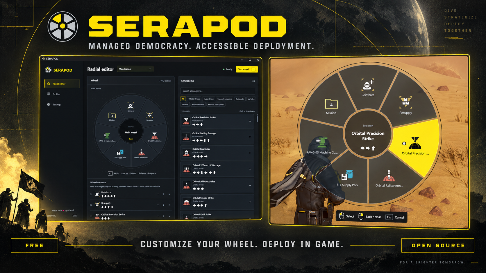
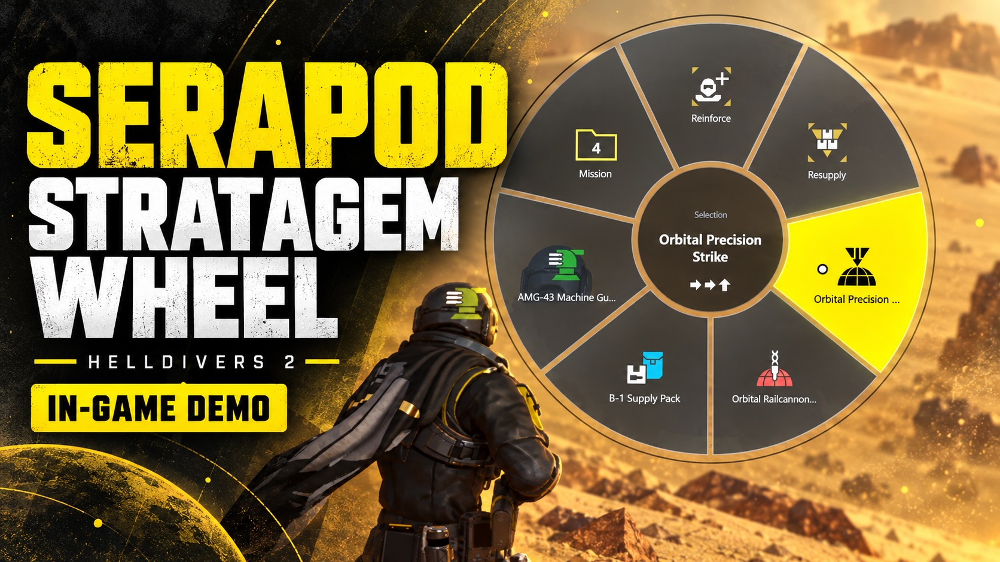
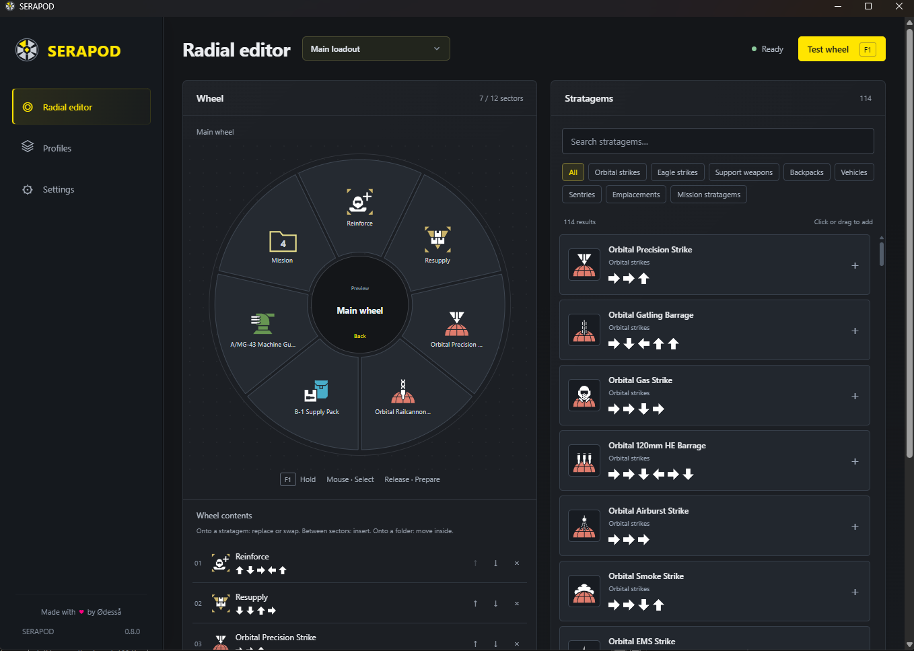
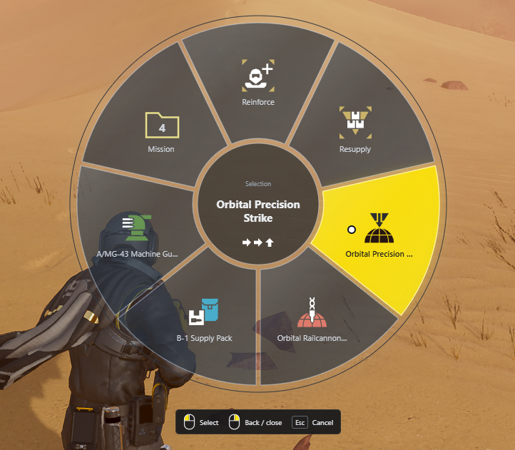
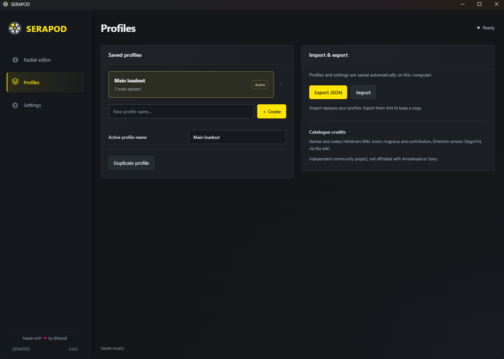
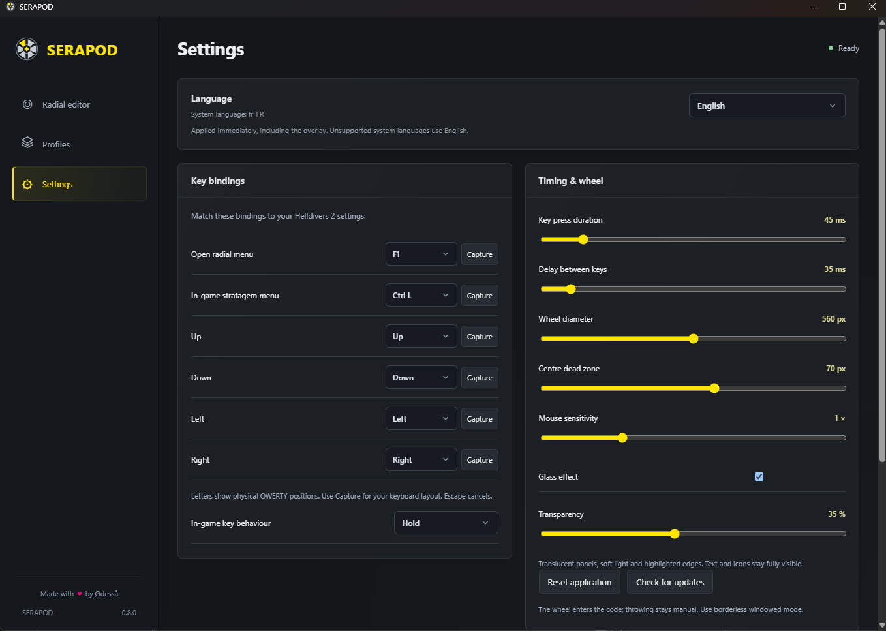

<p align="center">
  <a href="https://github.com/odessadraekavik/SERAPOD/releases/latest"></a>
  <a href="LICENSE"></a>
  
  
</p>

<p align="center"><b><a href="https://github.com/odessadraekavik/SERAPOD/releases/latest">Download for Windows</a> · <a href="#field-manual">Field manual</a> · <a href="#known-issues">Known issues</a> · <a href="#donations">Donations</a></b></p>

## Field footage

**See SERAPOD in action:** click the preview to watch the in-game demonstration on YouTube.

[](https://youtu.be/o3S7y8BjbNU)

[Watch on YouTube](https://youtu.be/o3S7y8BjbNU) · [Download the original gameplay clip](medias/ingame_preview_0.8.1.mp4)

<details>
<summary>Inspect the original screenshots — editor, in-game wheel, profiles & settings</summary>

### Radial editor


### In-game wheel


### Profiles


### Settings


</details>

*The promotional artwork is stylized; the screenshots above show the actual interface.*

## SUPER EARTH HIGH COMMAND BULLETIN #404

**TO:** ALL ACTIVE HELLDIVERS  
**FROM:** MINISTRY OF ACCESSIBILITY & ERGONOMIC WARFARE  
**SUBJECT:** DEPLOYMENT OF THE SERAPOD SYSTEM

Attention, Liberators.

It has come to the attention of the Ministry that severe, high-g combat drop-ins, Terminid acid burns, and minor explosive miscalculations can occasionally impede a Helldiver’s manual dexterity.

Joint fatigue should not revoke your citizenship. Repeated directional keypresses should not stand between you and a democratic orbital bombardment. Bureaucratic sympathy may be limited. Tactical accessibility is not.

Enter **SERAPOD — Super Earth Radial Accessibility Program for Orbital Deployment**: a customizable stratagem wheel for Helldivers 2.

> “Injury is a medical condition. Inefficiency is treason.”  
> — Super Earth Ergonomic Ordinance Directive 88-B

*The Ministry, its directives, and its alarming bedside manner are fictional. The accessibility goal is real.*

## Deliberately paced input — never an instant sequence

**Since 0.8.1, every directional key is separated by at least 100 ms. The default delay is 150 ms, adjustable from 100 to 300 ms.** Key press duration is additional (45 ms by default), so even the fastest allowed setting does not send the whole combination at once.

The intent is to approximate deliberate manual input rather than instantaneous execution. This is a fixed, configurable pace—not a measured simulation of a particular person. SERAPOD still automates the selected sequence; macros can also include delays, and this timing does not establish official approval or settle questions of fairness.

## Accessibility first

SERAPOD is for players who find repeated stratagem key sequences difficult, uncomfortable, or tiring: people with limited dexterity, motor impairments, joint stiffness, or repetitive-input fatigue, as well as anyone who benefits from an alternative input method.

Hold a configurable shortcut, move a pointer around a radial menu, and select a stratagem. SERAPOD enters that stratagem’s configured directional sequence. You remain in control of choosing it, aiming, and throwing or deploying it in the game.

The purpose is **accessibility and reduced input burden**, not cheating or gaining an unfair advantage. It does not reveal hidden information, change cooldowns, unlock equipment, read game memory, inject code into the game, or play missions for you. It uses a separate Windows overlay and standard keyboard/mouse APIs. It does automate the selected key sequence; calling it an accessibility tool does not imply official approval or guaranteed anti-cheat compatibility.

This is an independent fan project, not affiliated with or endorsed by Arrowhead Game Studios or Sony. No medical benefit or measured strain-reduction percentage is claimed. Accessibility needs vary; controls and timings are adjustable.

## Your new requisition

| Ministry-approved capability | What it does |
| --- | --- |
| **Radial deployment** | A 360° wheel with a visible dot pointer, up to 12 sectors per menu, and nested folders. |
| **Build your loadout** | Drag stratagems onto the wheel, replace entries, swap sectors, reorder, and organize folders. |
| **Persistent profiles** | Named loadouts, local autosave, import/export, and reset to defaults. |
| **Adjustable controls** | Shortcut, physical keyboard bindings, sensitivity, deadzone, wheel size, and sequence timing. |
| **Glass overlay** | Optional translucent styling with adjustable transparency. |
| **Automatic readiness** | Detects the running game; input is restricted to the game being in the foreground. |
| **English & français** | Starts in the system language, with a manual override in Settings. |
| **GitHub updates** | Checks for a newer stable release on startup and asks before downloading and restarting. |

No account. No subscription. No paid tier. The Ministry has misplaced the billing department.

## Field manual

1. **[Download the latest release](https://github.com/odessadraekavik/SERAPOD/releases/latest)** and put `SERAPOD-x.y.z.exe` in a folder you can write to. Windows needs the [Microsoft Edge WebView2 Runtime](https://developer.microsoft.com/microsoft-edge/webview2/), normally already installed on Windows 10/11.
2. Start SERAPOD. In **Settings**, match the game-menu key and directional keys to your Helldivers 2 bindings. Defaults: **Left Ctrl** for the game’s stratagem menu and **arrow keys** for directions.
3. Arrange your wheel and test it with the in-app preview. The preview sends no keys to the game.
4. Start Helldivers 2 in **borderless windowed** mode. Wait for the green **Ready** status.
5. Hold **F1**, move the dot onto a stratagem, then release F1 to select. Left-click also selects; on a folder it opens that folder.
6. Aim and deploy the stratagem yourself. High Command trusts you with this part. Mostly.

| While the wheel is open | Action |
| --- | --- |
| Move mouse | Choose a sector |
| Left-click | Select stratagem / open folder |
| Right-click | Go to parent folder; close at the main menu |
| Release shortcut over a stratagem | Enter its sequence |
| Release shortcut at center | Cancel |
| Escape | Cancel |

The first loadout includes Reinforce, Resupply, Orbital Precision Strike, Orbital Railcannon Strike, Supply Pack, and Machine Gun Sentry. A **Mission** folder contains Hellbomb, Super Earth Flag, SOS Beacon, and SEAF Artillery. Existing profiles are preserved when updating.

Physical key bindings use scan codes: displayed letter positions follow QWERTY. Use **Capture** to bind the intended physical key on AZERTY or another layout. The game-menu hold/toggle setting must match your game settings.

From **0.8.1**, the delay between keys defaults to **150 ms** and can be adjusted from **100 to 300 ms**. Previously saved or imported delays below 100 ms are upgraded to 150 ms while preserving profiles. Key press duration is a separate setting and is added to this delay.

## Updates & local storage

From **0.8.0**, SERAPOD checks this repository’s latest stable GitHub release at startup. The update dialog shows your current version in orange and the new version in green, release notes, **Update now**, and **No**. You can also check manually in Settings. An offline check does not prevent using the app.

An accepted update downloads the new executable **beside the old one**, displays progress, and checks its size and GitHub-published SHA-256 digest before launch. The new process waits for the old process to close before opening your profile. The old executable is deleted only after the replacement frontend loads. Failed downloads leave the current executable intact; failed cleanup leaves the old file for manual deletion. No installer, elevated updater, or system service is required. Use the versioned portable executable in a writable folder.

Settings and profiles are local WebView2 storage at:

```text
%LOCALAPPDATA%\app.serapod.desktop\EBWebView\Default\Local Storage\leveldb
```

This is a LevelDB store, not an editable JSON settings file. Use profile export for backups. Older `app.stratcom.desktop` data is migrated automatically when the new folder does not exist. **Reset application** restores options and the default wheel, removing custom profiles after confirmation.

The update check contacts GitHub. It sends no profiles, loadouts, or gameplay data. There is no analytics service.

## Known issues

- **Scrambled stratagems:** good luck with that… **not supported for now, sorry.** SERAPOD uses its stored codes and does not detect scrambling or mission modifiers.
- **No loadout/cooldown detection.** The wheel is configured by you; it does not know what is equipped, available, or on cooldown.
- **Game and anti-cheat updates may affect compatibility.** The wheel has been tested in-game, but compatibility is not a guarantee. SERAPOD neither disables nor modifies anti-cheat protections.
- **Exclusive fullscreen can hide overlays.** Use borderless windowed mode.
- **Input behavior can vary.** Check camera movement, cancellation, and bindings in your setup. Different privilege levels between the game and SERAPOD can prevent Windows from delivering input.
- **Catalogue data can become outdated.** The bundled catalogue is offline; see [asset and data credits](THIRD_PARTY.md).
- **One instance at a time.** Close older versions before opening another one manually.

Found an issue? [File a report](https://github.com/odessadraekavik/SERAPOD/issues) with your SERAPOD version, Windows version, and steps to reproduce. Do not include private profile data unless you want to share it.

## Always free. Always open source.

**SERAPOD will ALWAYS be free to use. No subscription. No paid features.** Its source code is available under the **GNU General Public License v3.0**.

**If someone charged you for an official SERAPOD download, subscription, or activation key, you have been scammed.** Get official builds here on GitHub. This promise about official distribution does not restrict the redistribution rights granted by the GPL.

## Donations

**Please don’t donate to me.** If SERAPOD helps you and you would like to give something back, I would be happy if you donated to a charity of your choice instead.

Your local animal shelter, for example. A little food, a warm blanket, or support for veterinary care can do more good than another coffee for a developer.

*Super Earth recognizes all good dogs, cats, and other rescued citizens as honorary defenders of Democracy.*

## Build from source

Windows prerequisites: Node.js 22+, pnpm, Rust stable, MSVC C++ build tools and Windows SDK, and WebView2. See the [Tauri Windows prerequisites](https://v2.tauri.app/start/prerequisites/).

```powershell
git clone https://github.com/odessadraekavik/SERAPOD.git
cd SERAPOD
pnpm install --frozen-lockfile
pnpm tauri dev          # native development app
# or: pnpm dev          # browser preview; no game input
./build.ps1             # checks, tests, frontend, native release, portable EXE
```

The output is `portable/SERAPOD-<version>.exe`. JavaScript and Rust dependencies are locked. See [release instructions](docs/RELEASING.md), [versioning](docs/VERSIONING.md), and [localization](docs/LOCALIZATION.md).

## License & credits

Copyright © 2026 Ødesså and SERAPOD contributors. SERAPOD’s original code and artwork are licensed under **GPL-3.0-only**; see [LICENSE](LICENSE).

Third-party stratagem icons, wiki arrows, game names, and data retain their original rights and attributions; the GPL statement does not relicense them. See [THIRD_PARTY.md](THIRD_PARTY.md).

---

**FIELD OPERATIONAL NOTICE**  
The enemies of Democracy do not pause for complex button inputs, and neither should you.  
*Equip SERAPOD today. Liberate tomorrow.*

Made with ♥ by **Ødesså**.
